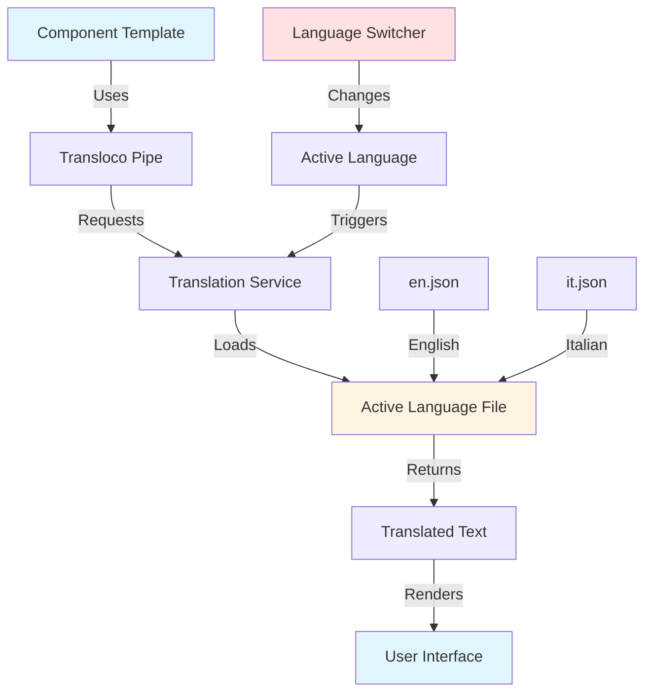
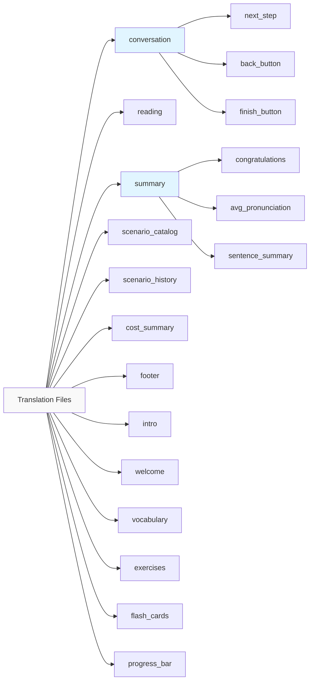

# Design Document

## Overview

This design document outlines the approach for internationalizing all remaining components in the Poli application using Transloco. The implementation will systematically extract hardcoded English text from component templates, create translation keys, and provide Italian translations. The design ensures consistency with existing internationalization patterns while maintaining code quality and user experience.

## Architecture

### Translation File Structure

The translation files follow a hierarchical namespace structure:

```
src/assets/i18n/
├── en.json (English translations)
└── it.json (Italian translations)
```

Each component's translations are organized under a namespace matching the component name:

```json
{
  "component_name": {
    "key_name": "Translation text",
    "another_key": "More text"
  }
}
```

### Component Integration Pattern

Components use Transloco's pipe syntax in templates:

```html
<p>{{ 'namespace.key' | transloco }}</p>
```

For dynamic content with interpolation:

```html
<p>{{ 'namespace.key' | transloco: { variable: value } }}</p>
```

## Components and Interfaces

### Components Requiring Internationalization

Based on the analysis, the following components need internationalization (excluding support components):

1. **conversation-view** - Main conversation interface with navigation and controls
2. **reading-mode** - Reading interface with instructions
3. **practice-view** - Practice interface (already has some i18n, needs completion)
4. **vocabulary** - Vocabulary step placeholder
5. **summary-view** - Results and statistics display
6. **scenario-catalog** - Scenario browsing interface
7. **scenario-history** - User's scenario history
8. **scenario-selector** - Category and topic selection (partially done, needs completion)
9. **cost-summary** - Cost analytics and reporting
10. **footer** - Application footer with links
11. **intro** - Instructional content
12. **welcome** - Welcome screen with intro
13. **undo-notification** - Already internationalized, verify completeness
14. **exercises** - Exercise components (fill-in-blank, matching-pairs, sentence-scramble, swipe)
15. **flash-cards** - Flash card interface
16. **progress-bar** - Progress indicator

### Translation Key Organization

Translation keys will be organized by component with the following structure:

```
conversation:
  - Navigation labels (back, next, finish)
  - Step indicators
  - Instructions
  - Toggle labels
  - Loading messages

reading:
  - Instructions
  - Tooltips
  - Button labels

summary:
  - Congratulations messages
  - Score labels
  - Status messages
  - Button labels

scenario_catalog:
  - Headers
  - Filter labels
  - Empty states
  - Loading messages

scenario_history:
  - Headers
  - Empty states
  - Loading messages

cost_summary:
  - Tab labels
  - Metric labels
  - Table headers
  - Error messages

footer:
  - Section headings
  - Link labels
  - Mission statement
  - Copyright text

intro:
  - Step titles
  - Step descriptions
  - Instructions

welcome:
  - Checkbox labels
  - Button labels

vocabulary:
  - Instructions
  - Button labels

exercises:
  - Instructions
  - Button labels
  - Feedback messages

flash_cards:
  - Instructions
  - Navigation labels

progress_bar:
  - Step labels
```

## Data Models

### Translation Entry Structure

Each translation entry follows this model:

```typescript
interface TranslationEntry {
  key: string;           // e.g., "conversation.next_step"
  en: string;            // English text
  it: string;            // Italian text
  interpolation?: {      // Optional dynamic values
    [key: string]: string;
  };
}
```

### Component Translation Mapping

```typescript
interface ComponentTranslations {
  component: string;     // Component name
  namespace: string;     // Translation namespace
  keys: TranslationEntry[];
}
```

## Error Handling

### Missing Translation Keys

- Transloco will display the key path if a translation is missing
- Development mode will log warnings for missing keys
- Fallback to English if Italian translation is not available

### Invalid Interpolation

- Transloco handles missing interpolation values gracefully
- Empty strings or undefined values will be displayed as-is
- No application crashes from translation errors

## Testing Strategy

### Manual Testing Checklist

1. **Language Switching**
   - Verify all components update when language is changed
   - Check that no hardcoded text remains visible
   - Confirm dynamic content interpolates correctly

2. **Component-Specific Testing**
   - Test each component in both English and Italian
   - Verify text fits within UI elements (no overflow)
   - Check that icons and formatting are preserved

3. **Edge Cases**
   - Empty states display correctly
   - Error messages are translated
   - Loading states show translated text
   - Pluralization works correctly (if applicable)

4. **Accessibility**
   - Screen reader text (aria-labels) is translated
   - Placeholder text is translated
   - Button labels are descriptive in both languages

### Translation Quality Checks

1. **Accuracy**
   - Italian translations are grammatically correct
   - Context-appropriate word choices
   - Consistent terminology across the application

2. **Consistency**
   - Same English terms translate to same Italian terms
   - UI element labels are consistent (buttons, links, etc.)
   - Tone and formality level is consistent

3. **Completeness**
   - All visible text is translated
   - No English text appears when Italian is selected
   - All dynamic messages have translations

## Implementation Approach

### Phase 1: Extract and Catalog

1. Identify all hardcoded text in each component
2. Create translation keys following naming conventions
3. Document interpolation requirements

### Phase 2: Update Translation Files

1. Add English keys to en.json
2. Create Italian translations in it.json
3. Organize keys by namespace
4. Maintain alphabetical order within namespaces

### Phase 3: Update Component Templates

1. Replace hardcoded text with Transloco pipes
2. Add interpolation where needed
3. Update aria-labels and accessibility text
4. Preserve HTML structure and styling

### Phase 4: Verification

1. Test each component in both languages
2. Verify no hardcoded text remains
3. Check UI layout with translated text
4. Validate accessibility features

## Translation Guidelines

### Key Naming Conventions

- Use snake_case: `next_step`, `back_button`
- Be descriptive: `avg_pronunciation_score` not `score1`
- Group related keys: `error_title`, `error_message`
- Use consistent suffixes: `_label`, `_button`, `_message`, `_title`

### Italian Translation Guidelines

1. **Formal vs Informal**
   - Use informal "tu" form for user-facing text
   - Maintain friendly, encouraging tone

2. **Technical Terms**
   - Keep brand names in English (Poli, Transloco)
   - Translate UI elements (button, menu, etc.)
   - Use standard Italian tech terminology

3. **Sentence Structure**
   - Adapt to Italian grammar (adjective placement, etc.)
   - Maintain natural flow
   - Preserve meaning over literal translation

4. **Punctuation**
   - Use Italian punctuation rules
   - Maintain consistent spacing
   - Preserve special characters and formatting

## Component-Specific Design Notes

### Conversation View

- Multiple navigation states require different labels
- Practice direction toggle needs bidirectional text
- Sentence counter uses interpolation: "Sentence {{current}} of {{total}}"

### Summary View

- Score displays need number formatting
- Conditional messages based on success/failure
- List of sentences with dynamic content

### Cost Summary

- Table headers and data labels
- Currency formatting (already handled by component)
- Number formatting (already handled by component)
- Tab navigation labels

### Footer

- Multiple link sections
- Social media labels (may remain as icons only)
- Copyright year is dynamic

### Scenario Components

- Empty state messages vary by context
- Loading messages during async operations
- Error messages for failed operations
- Difficulty level badges (consistent across components)

### Exercise Components

- Each exercise type has unique instructions
- Feedback messages for correct/incorrect answers
- Progress indicators
- Timer displays (if applicable)

## Mermaid Diagram: Translation Flow



## Mermaid Diagram: Component Translation Structure



## Migration Strategy

### Backward Compatibility

- Existing translated components remain unchanged
- New translations follow established patterns
- No breaking changes to component APIs

### Incremental Rollout

1. Start with high-visibility components (conversation, summary)
2. Progress to supporting components (scenarios, catalog)
3. Complete with utility components (footer, intro)
4. Final pass for exercise components

### Validation

- Each component tested individually after translation
- Integration testing with language switching
- User acceptance testing with Italian speakers
- Accessibility audit with screen readers

## Performance Considerations

### Translation Loading

- Translation files are loaded once at application startup
- No performance impact from using Transloco pipes
- Lazy loading not required for current file sizes

### Bundle Size

- Additional Italian translations add minimal size (~10-20KB)
- Acceptable overhead for internationalization feature
- Consider compression for production builds

### Runtime Performance

- Transloco caching ensures fast lookups
- No noticeable delay when switching languages
- Change detection optimized by Transloco

## Accessibility Considerations

### Screen Reader Support

- All aria-labels must be translated
- Button labels must be descriptive in both languages
- Form labels and placeholders translated
- Error messages accessible to screen readers

### Keyboard Navigation

- Translated labels don't affect keyboard navigation
- Focus indicators remain functional
- Shortcut keys (if any) documented in both languages

### Visual Considerations

- Italian text may be longer than English
- UI elements must accommodate text expansion
- Test for text overflow and wrapping
- Maintain readability at all font sizes
