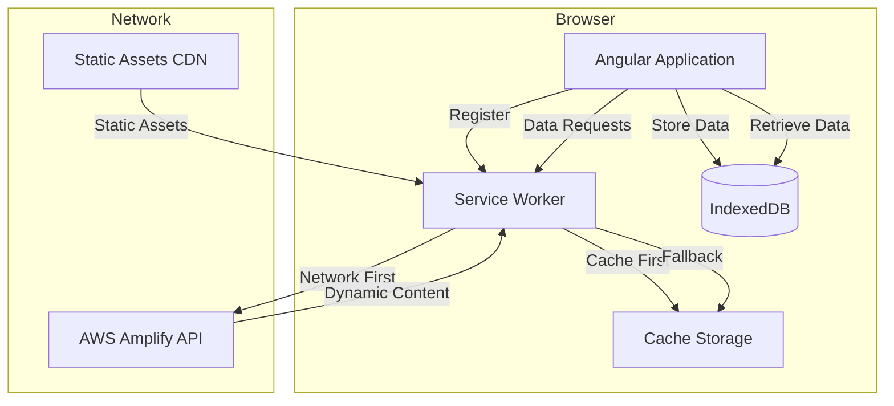

# PWA Offline Support Design Document

## Overview

This design document outlines the implementation of Progressive Web App (PWA) capabilities for the Angular language learning application. The solution leverages Angular's built-in PWA support through `@angular/pwa`, service workers for caching strategies, and the existing IndexedDB infrastructure (via the `idb` library) for offline data persistence.

The PWA implementation will enable:
- Application installation on user devices
- Offline-first architecture with intelligent caching
- Background synchronization when connectivity is restored
- Efficient cache management to prevent excessive storage usage

## Architecture

### High-Level Architecture



### Service Worker Caching Strategies

The application will implement multiple caching strategies based on resource type:

1. **Application Shell (Cache-First)**
   - HTML, CSS, JavaScript bundles
   - Fonts and icons
   - Cached during service worker installation
   - Updated only when service worker version changes

2. **Static Assets (Cache-First with Background Update)**
   - Images, SVG icons
   - Translation JSON files
   - Cached on first access
   - Updated in background when online

3. **API Responses (Network-First with Cache Fallback)**
   - Scenario data
   - Exercise data
   - User progress
   - Attempts network first, falls back to cache if offline

4. **Dynamic Content (Stale-While-Revalidate)**
   - Scenario lists
   - User history
   - Serves cached content immediately while fetching fresh data

## Components and Interfaces

### 1. Service Worker Configuration

**File**: `ngsw-config.json`

Angular's service worker configuration file that defines caching strategies for different resource groups.

```typescript
interface NgswConfig {
  index: string;
  assetGroups: AssetGroup[];
  dataGroups: DataGroup[];
  navigationUrls?: string[];
}

interface AssetGroup {
  name: string;
  installMode: 'prefetch' | 'lazy';
  updateMode: 'prefetch' | 'lazy';
  resources: {
    files?: string[];
    urls?: string[];
  };
  cacheQueryOptions?: {
    ignoreSearch?: boolean;
  };
}

interface DataGroup {
  name: string;
  urls: string[];
  version?: number;
  cacheConfig: {
    maxSize: number;
    maxAge: string;
    timeout?: string;
    strategy: 'freshness' | 'performance';
  };
}
```

### 2. Web App Manifest

**File**: `manifest.webmanifest`

Provides metadata for PWA installation.

```typescript
interface WebAppManifest {
  name: string;
  short_name: string;
  theme_color: string;
  background_color: string;
  display: 'standalone' | 'fullscreen' | 'minimal-ui' | 'browser';
  scope: string;
  start_url: string;
  icons: ManifestIcon[];
}

interface ManifestIcon {
  src: string;
  sizes: string;
  type: string;
  purpose?: 'any' | 'maskable' | 'monochrome';
}
```

### 3. Offline Status Service

**File**: `src/app/services/offline-status.service.ts`

Monitors network connectivity and provides reactive state.

```typescript
interface OfflineStatusService {
  // Signals
  isOnline: Signal<boolean>;
  isOffline: Signal<boolean>;
  
  // Methods
  checkConnectivity(): Promise<boolean>;
  addConnectivityListener(callback: (online: boolean) => void): void;
  removeConnectivityListener(callback: (online: boolean) => void): void;
}
```

### 4. Enhanced Offline Storage Service

**File**: `src/app/services/offline-storage.service.ts` (existing, to be enhanced)

The application already has an `OfflineStorageService` that uses IndexedDB. This will be enhanced to support PWA requirements.

```typescript
interface OfflineStorageService {
  // Existing methods
  cacheScenario(scenario: ConversationScenario): Promise<void>;
  getCachedScenario(id: string): Promise<ConversationScenario | null>;
  cacheExercise(scenarioId: string, type: ExerciseType, data: ExerciseData): Promise<void>;
  getCachedExercise(scenarioId: string, type: ExerciseType): Promise<ExerciseData | null>;
  
  // New methods for PWA
  getCacheSize(): Promise<number>;
  clearCache(): Promise<void>;
  getCachedScenarioIds(): Promise<string[]>;
  pruneOldCache(maxAgeMs: number): Promise<void>;
  
  // Sync queue for offline operations
  queueForSync(operation: SyncOperation): Promise<void>;
  getPendingSyncOperations(): Promise<SyncOperation[]>;
  clearSyncOperation(id: string): Promise<void>;
}

interface SyncOperation {
  id: string;
  type: 'save_history' | 'update_progress';
  data: any;
  timestamp: number;
  retryCount: number;
}
```

### 5. Background Sync Service

**File**: `src/app/services/background-sync.service.ts`

Handles synchronization of offline operations when connectivity is restored.

```typescript
interface BackgroundSyncService {
  // Signals
  isSyncing: Signal<boolean>;
  pendingOperations: Signal<number>;
  
  // Methods
  registerSync(): Promise<void>;
  performSync(): Promise<void>;
  addToSyncQueue(operation: SyncOperation): Promise<void>;
}
```

### 6. PWA Update Service

**File**: `src/app/services/pwa-update.service.ts`

Manages service worker updates and notifies users.

```typescript
interface PwaUpdateService {
  // Signals
  updateAvailable: Signal<boolean>;
  
  // Methods
  checkForUpdate(): Promise<boolean>;
  activateUpdate(): Promise<void>;
  subscribeToUpdates(callback: () => void): void;
}
```

### 7. Cache Management Service

**File**: `src/app/services/cache-management.service.ts`

Provides cache statistics and management capabilities.

```typescript
interface CacheManagementService {
  // Methods
  getCacheStats(): Promise<CacheStats>;
  clearAllCaches(): Promise<void>;
  clearServiceWorkerCache(): Promise<void>;
  clearIndexedDBCache(): Promise<void>;
}

interface CacheStats {
  totalSize: number;
  indexedDBSize: number;
  cacheStorageSize: number;
  itemCount: number;
  oldestItem: Date | null;
  newestItem: Date | null;
}
```

## Data Models

### Offline Indicator Component

**File**: `src/app/components/offline-indicator/offline-indicator.component.ts`

Visual indicator for offline status.

```typescript
interface OfflineIndicatorComponent {
  isOffline: Signal<boolean>;
  showDetails: boolean;
  
  toggleDetails(): void;
}
```

### Update Notification Component

**File**: `src/app/components/update-notification/update-notification.component.ts`

Notifies users of available updates.

```typescript
interface UpdateNotificationComponent {
  updateAvailable: Signal<boolean>;
  
  applyUpdate(): void;
  dismiss(): void;
}
```

### Cache Settings Component

**File**: `src/app/components/cache-settings/cache-settings.component.ts`

Allows users to manage cache storage.

```typescript
interface CacheSettingsComponent {
  cacheStats: Signal<CacheStats | null>;
  isClearing: Signal<boolean>;
  
  loadCacheStats(): Promise<void>;
  clearCache(): Promise<void>;
}
```

## Error Handling

### Offline Error Handling

1. **Network Request Failures**
   - Detect network errors in service calls
   - Automatically fall back to cached data
   - Display user-friendly offline messages

2. **Cache Miss Handling**
   - When offline and no cached data exists
   - Show informative message explaining content unavailability
   - Suggest actions (e.g., "This content will be available once you go online")

3. **Sync Failures**
   - Retry failed sync operations with exponential backoff
   - Maximum 3 retry attempts
   - Log failures for debugging

4. **Storage Quota Exceeded**
   - Detect quota exceeded errors
   - Automatically prune old cache entries
   - Notify user if manual intervention needed

### Error Recovery Strategies

```typescript
interface ErrorRecoveryStrategy {
  // Network errors
  handleNetworkError(error: Error, context: string): Promise<any>;
  
  // Cache errors
  handleCacheError(error: Error, operation: string): Promise<void>;
  
  // Sync errors
  handleSyncError(error: Error, operation: SyncOperation): Promise<void>;
  
  // Storage errors
  handleStorageError(error: Error): Promise<void>;
}
```

## Testing Strategy

### Unit Tests

1. **Service Worker Configuration**
   - Verify correct caching strategies
   - Test cache group configurations
   - Validate manifest structure

2. **Offline Status Service**
   - Test connectivity detection
   - Verify event listeners
   - Test signal updates

3. **Background Sync Service**
   - Test sync queue operations
   - Verify retry logic
   - Test conflict resolution

4. **Cache Management Service**
   - Test cache size calculations
   - Verify cache clearing
   - Test pruning logic

### Integration Tests

1. **Offline Scenario Loading**
   - Load scenario while online
   - Go offline
   - Verify scenario loads from cache

2. **Exercise Caching**
   - Generate exercises while online
   - Go offline
   - Verify exercises load from cache

3. **Background Sync**
   - Perform action while offline
   - Go online
   - Verify sync completes successfully

4. **Service Worker Updates**
   - Deploy new service worker version
   - Verify update notification
   - Test update activation

### Manual Testing Checklist

1. **Installation**
   - [ ] Install prompt appears on supported browsers
   - [ ] App installs successfully
   - [ ] App launches in standalone mode
   - [ ] Correct icon and name displayed

2. **Offline Functionality**
   - [ ] App loads while offline
   - [ ] Previously viewed scenarios accessible offline
   - [ ] Exercises work offline
   - [ ] Translation files available offline
   - [ ] Offline indicator displays correctly

3. **Caching**
   - [ ] Static assets cached on first load
   - [ ] API responses cached appropriately
   - [ ] Cache updates when online
   - [ ] Old cache entries pruned

4. **Synchronization**
   - [ ] Offline actions queued for sync
   - [ ] Sync occurs when online
   - [ ] Sync conflicts resolved correctly
   - [ ] Sync status displayed to user

5. **Updates**
   - [ ] Update notification appears
   - [ ] Update applies correctly
   - [ ] No data loss during update

6. **Cache Management**
   - [ ] Cache stats display correctly
   - [ ] Clear cache works
   - [ ] Storage limits respected

## Implementation Phases

### Phase 1: Core PWA Setup
- Install @angular/pwa package
- Configure service worker
- Create web app manifest
- Add PWA icons
- Configure angular.json for PWA build

### Phase 2: Offline Status Monitoring
- Implement OfflineStatusService
- Create offline indicator component
- Integrate with existing services
- Add offline state to SessionStore

### Phase 3: Enhanced Caching
- Update service worker configuration
- Enhance OfflineStorageService
- Implement cache management service
- Add cache settings UI

### Phase 4: Background Synchronization
- Implement BackgroundSyncService
- Add sync queue to IndexedDB
- Integrate with GeminiService
- Handle sync conflicts

### Phase 5: Update Management
- Implement PwaUpdateService
- Create update notification component
- Add update check logic
- Test update flow

### Phase 6: Testing and Optimization
- Write unit tests
- Perform integration testing
- Manual testing across devices
- Performance optimization
- Cache size optimization

## Performance Considerations

### Cache Size Management

1. **Maximum Cache Sizes**
   - Application shell: No limit (essential)
   - Static assets: 20MB
   - API responses: 30MB
   - Total IndexedDB: 50MB

2. **Pruning Strategy**
   - Remove entries older than 7 days
   - Use LRU (Least Recently Used) for overflow
   - Keep minimum 10 most recent scenarios

3. **Lazy Loading**
   - Don't precache all translation files
   - Cache translations on language selection
   - Lazy load exercise data

### Network Optimization

1. **Request Prioritization**
   - Critical: Application shell, current scenario
   - High: Translation files, exercises
   - Low: Historical data, analytics

2. **Bandwidth Detection**
   - Reduce cache updates on slow connections
   - Skip background updates on 2G/3G
   - Full sync on WiFi only (configurable)

### Battery Optimization

1. **Background Sync Throttling**
   - Limit sync frequency to once per minute
   - Batch multiple operations
   - Skip sync if battery low (<20%)

2. **Service Worker Lifecycle**
   - Minimize service worker wake-ups
   - Use efficient event listeners
   - Avoid unnecessary cache checks

## Security Considerations

### Service Worker Security

1. **HTTPS Requirement**
   - Service workers only work over HTTPS
   - Localhost exception for development
   - Ensure production deployment uses HTTPS

2. **Content Security Policy**
   - Update CSP headers for service worker
   - Allow service worker scripts
   - Restrict service worker scope

### Data Security

1. **Sensitive Data Handling**
   - Don't cache authentication tokens
   - Encrypt sensitive data in IndexedDB
   - Clear cache on logout

2. **Cache Poisoning Prevention**
   - Validate cached data before use
   - Implement cache versioning
   - Clear cache on security updates

## Browser Compatibility

### Supported Browsers

- Chrome/Edge: Full support (v90+)
- Firefox: Full support (v88+)
- Safari: Partial support (v14+, no background sync)
- Mobile browsers: Full support on Android, partial on iOS

### Fallback Strategy

For browsers without service worker support:
- Application still functions normally
- No offline capability
- No installation option
- Graceful degradation of features

### Progressive Enhancement

1. **Feature Detection**
   - Check for service worker support
   - Check for Cache API support
   - Check for Background Sync API support

2. **Conditional Features**
   - Show install prompt only if supported
   - Enable background sync only if supported
   - Provide alternative for unsupported features

## Deployment Considerations

### Build Configuration

1. **Production Build**
   ```bash
   ng build --configuration production
   ```
   - Generates service worker
   - Creates ngsw.json manifest
   - Optimizes bundles

2. **Service Worker Registration**
   - Register in main.ts after bootstrap
   - Handle registration errors
   - Log registration status

### Hosting Requirements

1. **Static File Hosting**
   - Serve ngsw.json at root
   - Serve manifest.webmanifest at root
   - Correct MIME types for all files

2. **Cache Headers**
   - No-cache for index.html
   - Long cache for hashed assets
   - Appropriate cache for ngsw.json

### Monitoring and Analytics

1. **Service Worker Metrics**
   - Track installation success rate
   - Monitor cache hit rates
   - Log update adoption rate

2. **Offline Usage Metrics**
   - Track offline sessions
   - Monitor sync success rate
   - Measure cache effectiveness

3. **Error Tracking**
   - Log service worker errors
   - Track cache failures
   - Monitor sync failures

## Migration Path

### Existing Users

1. **First Update**
   - Service worker installs on first visit after deployment
   - Existing localStorage data preserved
   - Gradual cache population

2. **Data Migration**
   - No migration needed (IndexedDB already in use)
   - Service worker adds caching layer
   - Transparent to users

### Rollback Plan

1. **Service Worker Removal**
   - Unregister service worker if needed
   - Clear all caches
   - Application continues without PWA features

2. **Version Pinning**
   - Pin service worker version in emergency
   - Prevent automatic updates
   - Manual update trigger for fixes
